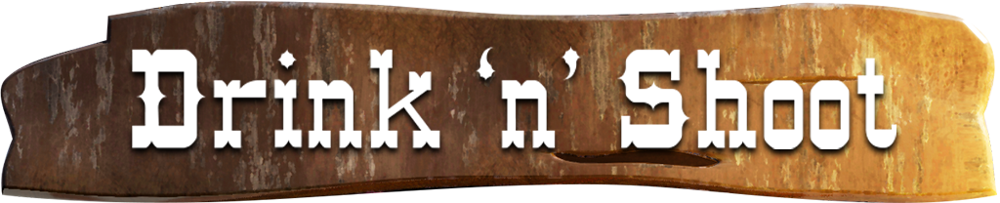

# Drink 'n' Shoot

<b>"Drink 'n' Shoot"</b> is an arcade-like, time trial first person shooter set in the wild west. You play as a cowboy who has drinking problems, 
but that is quite deadly with the gun. That's why your job will be to shoot the flocks of crows that threaten the peaceful little town.

This is a game (demo/protoype/vertical slice) developed by students from <a href="https://www.imagecampus.edu.ar/">Image Campus</a>.

   

## Credits
(in alphabetical order)

- **Santiago Ibarra** - *Art / Game Design* - </a> 
- **Martín Ignacio Monterrosa** - *Programming / Game Design* -  
- **Ignacio Mosconi** - *Programming / Game Design* -  - <a href="nacho7577@hotmail.com"> nacho7577@hotmail.com </a>
- **María Soledad Pérez Blanco** - *Audio*
- **Matías Pilotto** - *Testing* - 

This game was also possible thanks to the support of these professors:

- **Sergio Baretto**
- **Jorge Cuéllar**
- **Fernando Puig**
- **Eugenio Taboada**

## Acknowledgements

Special thanks to all of the students from <a href="https://www.imagecampus.edu.ar/">Image Campus</a> that tested our game during the development stages, as their support and feedback was really helpful to us.

## Links

Download it from itch.io: https://ignacio-mosconi.itch.io/drink-n-shoot
